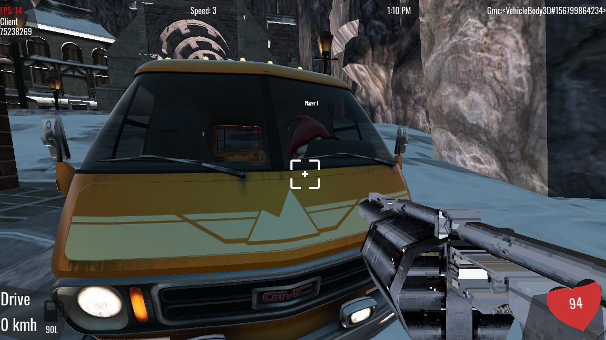
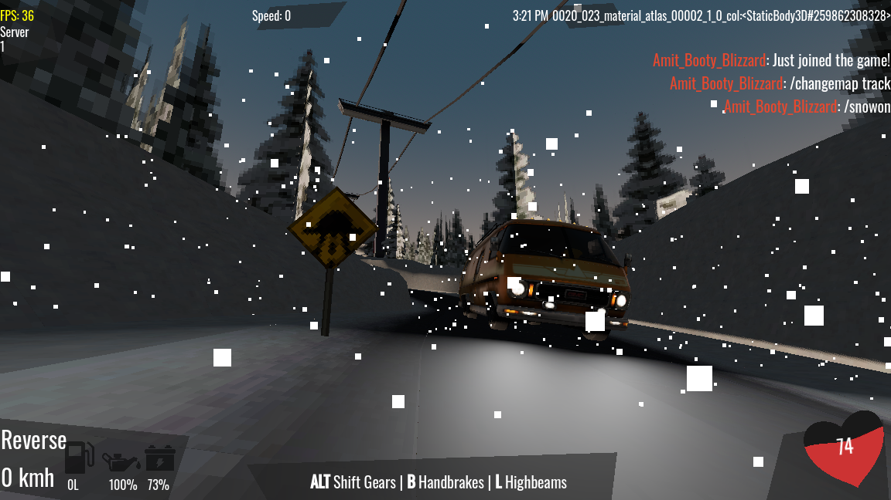
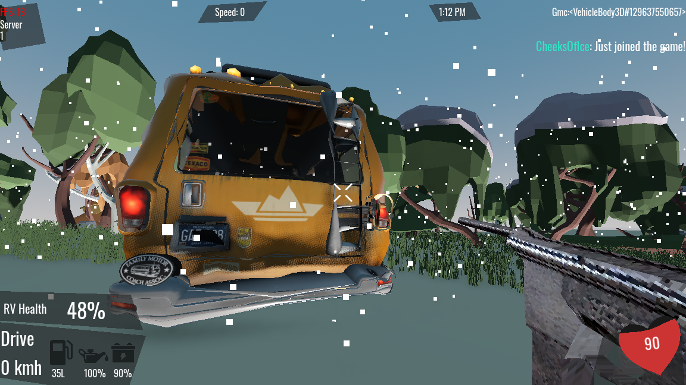
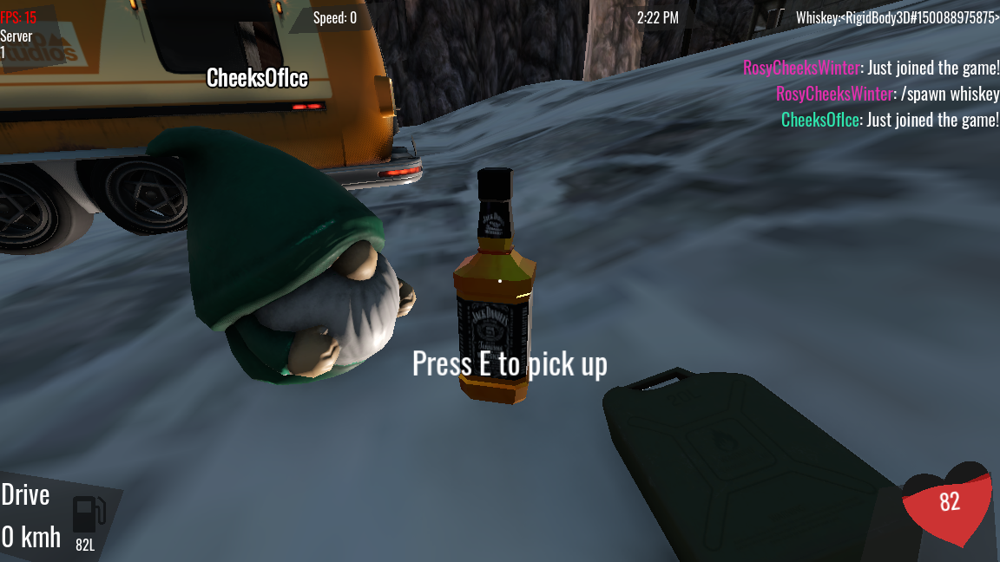
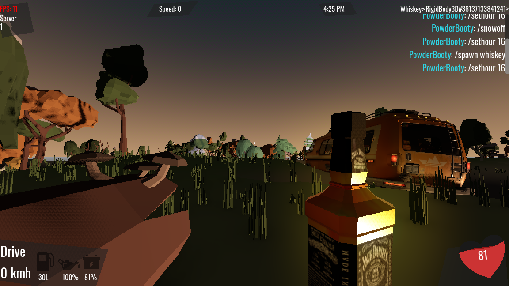

# JaRV

Welcome to **JaRV**, the definitive co-op RV survival experience where low-poly aesthetics meet high-stakes road trips. 

Traverse desolate landscapes in your customizable motorhome. Whether you are battling a blizzard, managing your "supplies," or trying to keep the chassis from falling apart after a crash, JaRV offers a unique blend of vehicular maintenance, cooperative survival, and chaotic physics.

## Key Features

* **Co-op Survival:** Team up with friends (as garden gnomes!) to navigate, defend, and maintain your mobile base.
* **Detailed Vehicle Systems:** Monitor real-time telemetry including fuel levels, oil quality, and battery life. 
* **Dynamic Damage Model:** Your RV isn't invincible. Watch it dent and deform in real-time. Keep an eye on that **RV Health** percentage.
* **Survival Essentials:** Scavenge for resources to keep the crew going—from fuel canisters to "medicinal" whiskey.
* **Defensive Combat:** Equip firearms to protect your convoy from external threats as you push through the wilderness.

## Gallery

### The Cockpit
Keep your eyes on the road and your hand on the wheel. Managing the HUD is the difference between reaching the next town and being stranded.

### Braving the Elements
Engage high-beams and navigate through heavy snowfall. Use chat commands to control the environment and manage server settings.

### High Stakes & Hard Knocks
The road is unforgiving. Repair your RV after heavy damage to keep the "RV Health" from hitting zero.

### Scavenging
Survival requires more than just gas. Explore the environment to find essential pick-ups and interactable items.

### Sunset Travels
Take a moment to appreciate the low-poly horizons before the night-time threats arrive.

## Getting Started

1.  **Clone the repository:** `git clone https://github.com/nnj1/jarv.git`
2.  **Make sure blender is installed to load some models** 
3.  **Launch the game**

---
*JaRV - Survival is better on four wheels (and with a bottle of whiskey).*
